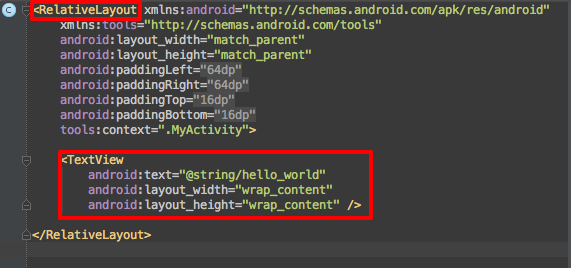
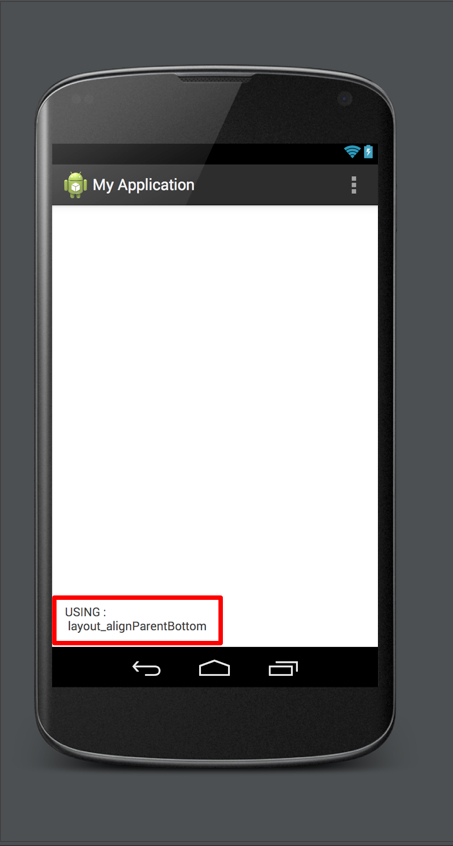
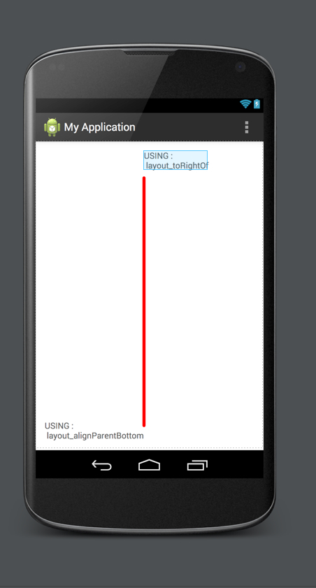
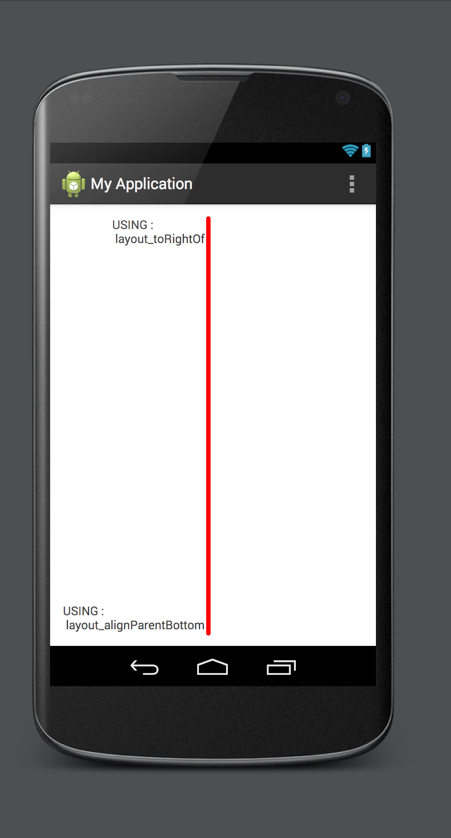
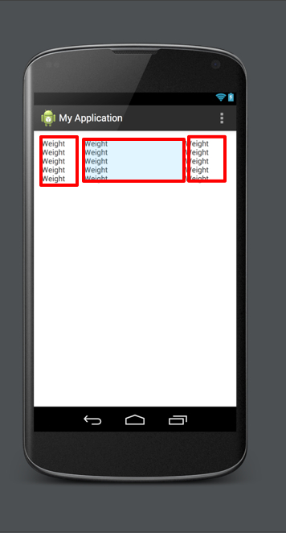
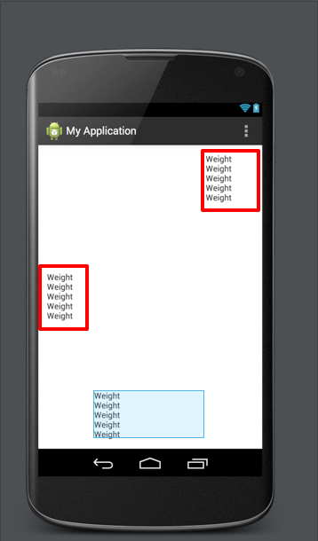

[Resource 1]

[Resource 2]

[Resource 3]


Getting Start
=========

หลังจากที่ได้รักจักกับเครื่องมือในการพัฒนาแอพพลิเคชันสำหรับระบบปฏิบัติการ Android ด้วย Android Studio และการตั้งค่าของตัว Emulator เป็นที่เรียบร้อยใน Part ที่สองนี้เราจะเริ่มทำการพัฒนาต่อยอดจากตัว Project ไฟล์ที่เราได้สร้างไว้ใน Part แรก โดยถ้าเราสังเกตุว่าโครงสร้างของตัว Project นั้นจะถูกจัดวางอย่างเป็นระบบโดยที่เราไม่ต้องเสียเวลาในการวางโครงสร้างของไฟล์ต่างๆ ซึ่งทั้งหมดถูกจัดการโดย Android Studio นั่นเอง


***

XML Layout Basic
=========

หลังจากที่ได้เกริ่นนำไปลแ้วสำหรับไฟล์ที่ใช้ในการวาง Layout ของ Application Android นั่นก็คือไฟล์ XML ซึ่งแต่ละ Layout ไฟล์จะอยู่ในลักษณะของ Tree Structure ของ View ต่างๆ หรือพูดได้ง่ายๆ คือ View แม่ก็จะสามารถมี View ลูกเป็น sub view นั่นเอง หลังจากนี้ไปเราจะได้ทำงานกับไฟล์ XML เป็นส่วนใหญ่ใน Part นี้ 

กลับมาที่ Android Studio แล้วเลือกเปิดไฟล์ **activity_my.xml** หรือใน **src/layout/activity_my.xml** ดังรูปต่อไปนี้



จากภาพสังเกตุได้ว่าในไฟล์นี้จะมีโครงสร้างของ Tree โดยมี **RelativeLayout** เป็นฐานราก และมี **TextView** เป็นลูกของมัน ถ้าเรามองเฉพาะ **TextView** จะเห็นได้ว่า 2 ค่าของ **Attribute** มีค่าที่อ้างถึงวิวหลักหรือวิวแม่นั่นก็คือค่าของ **layout_width** และ **layout_height** ทั้งนี้ไม่ว่าการวาง layout ของเราจะเป็นแบบไหนค่าสองค่านี้ก็จะต้องถูกตั้งค่าไว้เสมอ โดยการตั้งค่าส่วนใหญ่เป็นไปได้สองกรณีดังนี้ 

 - **warp_content** หมายถึงการตั้งค่าให้ View ที่เรากำลังออกแบบอยู่นั้นมีขนาดที่พอดีกับสิ่งที่ View นั้นๆ แสดงอยู่ ตัวอย่างเช่น TextView จะมีขนาดพอดีกับตัวข้อความที่มีอยู่นั่นเอง
 - **match_parent** หมายถึงการตั้งค่าให้ View ที่เรากำลังออกแบบอยู่นั้นมีขนาดเท่ากับ View หลัก

###### Note : ปกติแล้วการตั้งค่าของ **Layout Attribute** ต่างๆ สามารถที่จะเป็นค่าของ **Dimension (Ex: 5dp)** แต่โดยทั่วไปจะใช้เป็นหน่วยของ **density independent pixels (Ex: 5dp)** เพื่อที่จะทำให้มีค่าที่สามารถแปรผันตรงได้กับมือถือหรือแทบเล็ตที่มีขนาดหนาของจอภาพที่ต่างกัน

นอกจาก **Attribute** **layout_width** และ **layout_height** แล้วยังมี **text** ซึ่งก็คือค่าของตัวอักษรที่จะนำเอามาแสดงผลใน **TextView** นั่นเองแต่ถ้าสังเกตุดูที่ค่าของ **text** มีค่าเป็น **@string/hello_world** ซึ่งมันไม่ได้มีค่าที่ตรงกับจอภาพ Preview ที่อยู่ทางด้านขวามือของ Anfroid Studio ที่เป็ยเช่นนี้ก็เพราะค่าที่เรากำหนดขึ้นนี้ไม่ใช่ค่าของ ***string** ที่เรากำหนดไว้ แต่เพียงเป็นการอ้งอิงถึง **string resource ID** แทนที่ข้อความจริง ซึ่ง **string resource** ที่กล่าวถึงนี้จะถูกจัดเก็บในรูปแบบ **XML** เช่นเดียวกัน โดยจะถูกจัดเก็บอยู่ที่ **res/value/strings.xml** นั่นเอง

***

### Relative Layouts

ถ้าพูดถึงเรื่อง **Layout** ของ **iOS** แน่นอนครับว่าจะมองในมุมมองของ **Absolute Frame Position** สำหรับการวาง **Layout** ตัวอย่างเช่น **“Place View X at pixels (x,y)”** แต่ในปัจจุบัน **iOS** มี **Auto Layout** เป็นตัวจัดการ แต่ในสทางกลับกัน นักพัฒนา **Application Android** จะไม่มองการวาง **Layout** ด้วยขนาดของจอภาพ แต่จะมองในลักษะของ **RelativeLayout** ซึ่งเป็นส่วนช่วยให้การวาง **Layout** ทำได้ง่ายขึ้น **RelativeLayout** ทำหน้าที่เป็นตัวกำหนดตำแหน่งต่างของ **Child View** โดยที่แต่ละ **View** จะมีความสัมพันธ์ต่อกัน รูปต่อไปนี้จะแสดงให้เห็นถึง 3 ลักษณะของความสัมพันธ์ในการจัดวางในรูปแบบต่างๆ ที่เราสามรถจะเอามาทำงานได้

##### ตัวอย่างที่ 1 **layout_alignParentBottom** 


จากตัวอย่างข้างต้น การใช้**layout_alignParentBottom** จะมีลักษณะการจัดวางของวิวสำหรับการตั้งค่าให้ชิดขอบของจอภาพด้านบน โดยลักษณะที่เหมือนกันก็คือ จะจัดเรียตามหัวมุมของจอภาพนั่นเอง

##### ตัวอย่างที่ 2 **layout_toRightOf** 


จากตัวอย่างที่ 2 นี้ **layout_toRightOf** จะทำหน้าที่จัดเรียงวิวให้อยู่ทางด้านขวามือของวิวที่มีความสัมพันธ์กัน

##### ตัวอย่างที่ 3 **layout_alignRight** 


You can use layout_alignRight and the analogous attributes to align a side of one View with another.
จากตัวอย่างที่ 3 **layout_alignRight** จะทำหน้าที่จัดเรียงวิวให้มรการจัดเรียงชิดขอบขวามือของวิวที่มีความสัมพันธ์

***

### Linear Layouts

นอกจาก **Relative Layouts** แล้วยังมี **Linear Layouts** ให้นักพัฒนาแอพพลิเคชันได้เลือกใช้ในการดีไซน์หน้าตาของแอพพลิเคชันอีกด้วย โดยที่ **Linear Layouts** สามารถเลือกใช้งานได้ในสองลักษณะคือ **Vertical** และ **Horizontal** ซึ่งก็คือแนวตั้งและแนวนอนนั่นเอง ข้อสังเกตุที่สำคัญอีกสิ่งนึงที่ต้องคำนึงในการใช้งาน **Linear Layouts** ก็คือวิวลูกที่อยู่ภายใต้ Layout นี้จะไม่ตอบสนองการ set ค่าของ **layout_toRightOf** แต่จะเือกตอบสนอง **layout_weight** และ **layout_gravity** ความหมายของค่าสองค่านี้สามารถอธิบายได้ดังนี้

 - **layout_weight** ทำหน้าที่เป็นตัวกำหนดน้ำหนักวิวนั้นๆ โดยที่ค่าของน้ำหนักเกิดจากการคำนวณด้วยจำนวนทั้งหมดของวิวลูกที่มีอยูใน **linear layouts** แล้วนำมาเป็นตัวหารให้กับค่าของน้ำหนักของวิวที่เรากำลังจัดวางนั่นเอง ดังภาพตัวอย่างต่อไปนี้

 

 - **layout_gravity** ทำหน้าที่เหมือนเป็นตัวกำหนกให้วิวนั้นๆ แบนไปในด้านต่างๆ ตัวอย่างเช่น กำหนดให้อยู่ทางด้านซ้ายหรือด้านขวาของ **LinearLayout**

 


Before you move on to the next section, open res/layout/activity_main.xml and change the root node from a RelativeLayout — what Android Studio gave you as a default — to a LinearLayout.
To do that, you should replace these lines:

ห่อนที่เราจะมาเริ่มต้นการเขียน **Design** แอพพลิเคชันของเรานั้นให้ เตรียมโครงสร้างไฟล์ **res/layout/activity_my.xml** โดยทำการเปลี่ยน **RelativeLayout** ไปเป็น **LinearLayout** ดังต่อไปนี้

```
<RelativeLayout xmlns:android="http://schemas.android.com/apk/res/android"
    android:layout_width="match_parent"
    android:layout_height="match_parent"
    android:orientation="vertical">
```
และ

```
</RelativeLayout>
```

สุดท้ายจะได้ผลลัพท์ดังนี้

```
<LinearLayout xmlns:android="http://schemas.android.com/apk/res/android"
	android:layout_width="match_parent"
	android:layout_height="match_parent"
	android:orientation="vertical">
</LinearLayout>
```

### Tobe continue....

[download the JDK]:http://www.oracle.com/technetwork/java/javase/downloads/index.html
[Android Studio Page]:https://developer.android.com/sdk/installing/studio.html
[Resource 1]:../images/ic_books.png
[Resource 2]:../images/img_books_large.png
[Resource 3]:../images/img_books_loading.png

